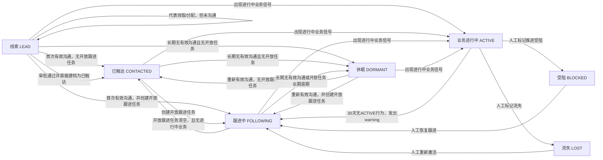

# CRM 客户阶段流转设计草案

## 状态

本文记录 CRM 客户阶段流转的一版产品与系统行为口径，供后续评审和实现拆分使用。

当前代码仍以 `CrmCustomerProfile.stage` 字符串字段为准。本文不是已落地实现说明；后续如进入开发，需要同步修改 `src/lib/crm/constants.ts`、`src/lib/crm/lifecycle.ts`、CRM 客户创建入口、互动/打卡/跟进任务入口，以及代表运营统计口径。

---

## 设计目标

1. 收窄 `NEW` 的语义，避免把线索、待触达、已分配未沟通混在一起。
2. 明确 `CONTACTED` 与 `FOLLOWING` 的边界，减少运营判断歧义。
3. 修正当前“历史有效订单数 > 0 即自动 ACTIVE”的风险，避免 `BLOCKED` / `LOST` 被旧订单重新拉回活跃。
4. 将阶段流转绑定到具体系统行为，而不是依赖模糊人工解释。
5. 区分“销售跟进中”和“业务履约/成交进行中”，避免 `FOLLOWING` 与 `ACTIVE` 混用。
6. 保留“新客户”作为代表运营指标，但将它定义为阶段转化事件，而不是一个长期停留阶段。

---

## 建议阶段

| 阶段 | 中文名 | 含义 |
| --- | --- | --- |
| `LEAD` | 线索 | 已进入系统，但代表尚未添加有效沟通。代表领取或分配后，如果没有沟通记录，仍保持 `LEAD`。 |
| `CONTACTED` | 已触达 | 已发生有效沟通，但当前没有开放的下一步销售跟进任务。 |
| `FOLLOWING` | 跟进中 | 当前存在开放的下一步销售跟进任务。 |
| `ACTIVE` | 业务进行中 | 当前存在有效业务推进、承接或履约信号。 |
| `DORMANT` | 休眠 | 长期无有效沟通、无开放跟进，且无进行中业务。 |
| `BLOCKED` | 受阻 | 人工标记的推进受阻状态，不被普通自动规则覆盖。 |
| `LOST` | 流失 | 人工标记的流失状态，不被普通自动规则覆盖。 |

兼容建议：

1. 旧数据中的 `NEW` 统一迁移为 `CONTACTED`，避免迁移时误判客户是否已分配、是否已触达。
2. 迁移后 `NEW` 不再作为合法写入值，也不作为新建客户默认阶段；运行时仅做防御性读兼容，读取到漏网 `NEW` 时按 `CONTACTED` 处理。
3. `ACTIVE` 建议改中文为“业务进行中”或“合作中”，不要继续只叫“活跃”，避免与“最近沟通活跃”混淆。

### 新客户指标

代表运营中的“新客户”建议保留为统计指标，而不是客户阶段。

第一版建议“新客户”统计以下事件：

1. 本统计周期内，客户从 `LEAD` 首次转为 `CONTACTED` 或 `FOLLOWING`。
2. 本统计周期内，代表提交的新客户申请审批通过，并直接生成 `CONTACTED` 客户。
3. 同一统计周期内按 `sourceCustomerId` 去重；同一客户同时命中阶段转化和审批通过时，只计一次。

可在代表运营中增加线索转化率：

```text
线索转化率 = 本周期 LEAD -> CONTACTED/FOLLOWING 客户数 / 本周期新增或分配给代表的 LEAD 客户数
```

不建议计入“新客户”的情况：

1. 代表仅领取或被分配客户，但没有新增有效沟通。
2. 旧数据迁移时从 `NEW` 批量转为 `CONTACTED` 可以计入上线当期统计；如需排除，后续再加迁移事件标记。

---

## 核心定义

### 有效沟通

有效沟通指代表对客户发生了可解释的业务动作。第一版建议包括：

1. 拜访打卡完成。
2. 新增电话、微信、邮件、会议、拜访、转介绍等互动记录。
3. 跟进任务完成时关联了一条有效互动记录。

`NOTE` 默认不算有效沟通，除非后续产品明确将某类备注纳入沟通。

### 下一步销售跟进任务

产品层不使用 `nextActionAt` 作为用户概念。用户看到的是“下次跟进时间”或“跟进任务截止时间”。

系统层定义：

```text
存在 OPEN 的 CRM 销售跟进任务
=> 客户处于 FOLLOWING
```

销售跟进任务包括：

1. 用户在客户详情中直接新建的 CRM 跟进任务。
2. 互动记录中填写下次跟进时间后自动生成的跟进任务。
3. 休眠唤醒类任务，如 `CRM_REACTIVATION`。
4. ACTIVE 冷却期到期后生成或保留的 warning 跟进任务。

ACTIVE 冷却期到期后的 warning 会驱动客户降级到 `FOLLOWING`。后续从 `FOLLOWING` 继续降级到 `DORMANT` 时，使用独立的 30 天窗口，不沿用普通休眠阈值。

### ACTIVE 业务信号

`ACTIVE` 不再等同于“历史上有过有效订单”。建议定义为：

```text
当前存在有效进行中的业务承接或履约信号
```

第一版可考虑以下信号：

1. 有有效订单，且订单处于 `CONFIRMED`。
2. 有关联项目，且项目处于 `IN_PROGRESS`。
3. 有开放的业务履约类任务。

不建议纳入 `ACTIVE` 的信号：

1. 普通 CRM 销售跟进任务。
2. 休眠预警任务。
3. 历史已关闭订单。
4. 历史已完成项目。
5. 尚未开始的项目状态，例如 `NOT_STARTED`。

### 活跃度降级

`ACTIVE` 代表当前业务进行中，但业务结束后不应立刻掉回销售阶段。第一版建议增加 30 天冷却期：

```text
最后一个 ACTIVE 行为结束后 30 天内
=> 继续保持 ACTIVE

超过 30 天仍无新的 ACTIVE 行为
=> 降级为 FOLLOWING，并生成/保留预警跟进任务
```

其中 ACTIVE 行为包括：

1. 订单处于 `CONFIRMED`。
2. 项目处于 `IN_PROGRESS`。
3. 后续确认的业务履约类开放任务。

降级链路：

```text
ACTIVE
=> 30 天无 ACTIVE 行为，发出 warning，降级 FOLLOWING
=> 再过 30 天仍无有效沟通或 ACTIVE 行为，降级 DORMANT
```

这套设计实际上把客户阶段变成活跃度等级：业务进行中、销售跟进中、已触达、休眠。

实现上需要在 `CrmCustomerProfile` 上持久化冷却期状态，避免只靠历史日志推算：

```text
lastActiveBehaviorEndedAt: DateTime?
activeCooldownEndsAt: DateTime?
activeWarningIssuedAt: DateTime?
```

其中：

1. `lastActiveBehaviorEndedAt`：最后一个 `CONFIRMED` 订单结束、`IN_PROGRESS` 项目结束，或业务履约任务结束的时间。
2. `activeCooldownEndsAt`：`lastActiveBehaviorEndedAt + 30 天`。
3. `activeWarningIssuedAt`：warning 生成并降级到 `FOLLOWING` 的时间；后续 30 天仍无动作时进入 `DORMANT`。

---

## 自动流转图



---

## 系统行为到阶段的映射

| 系统行为 | 阶段影响 |
| --- | --- |
| 客户申请或导入创建线索 | 默认 `LEAD`。 |
| 分配或领取客户 | 仍保持 `LEAD`，直到代表新增有效沟通。 |
| `LEAD` 客户发生有效沟通 | 无开放跟进任务时进入 `CONTACTED`；同时创建下次跟进任务时进入 `FOLLOWING`。 |
| 完成拜访打卡 | 视为有效沟通。无开放跟进任务时进入 `CONTACTED`；同时创建下次跟进任务时进入 `FOLLOWING`。 |
| 新增联络记录 | 视为有效沟通。无开放跟进任务时进入 `CONTACTED`；同时创建下次跟进任务时进入 `FOLLOWING`。 |
| 新客户申请审批通过 | 一律生成 `CONTACTED`，并计入代表“新客户”指标；代表主动申请默认表示已有联系。 |
| 直接新建 CRM 跟进任务 | 所有非锁定、非 `ACTIVE` 客户进入或保持 `FOLLOWING`，包括 `DORMANT`。 |
| 完成 CRM 跟进任务 | 不关联有效互动时不触发阶段变更；如果本次完成关联有效互动，则按有效沟通规则推进：仍有开放任务保持 `FOLLOWING`，无开放任务且无进行中业务时回到 `CONTACTED`。 |
| 新订单进入 `CONFIRMED` | 非锁定阶段进入 `ACTIVE`。 |
| 项目进入 `IN_PROGRESS` | 非锁定阶段进入 `ACTIVE`。 |
| 进行中订单/项目全部结束 | 记录最后 ACTIVE 行为结束时间，客户继续保持 `ACTIVE` 30 天。 |
| ACTIVE 冷却期到期 | 30 天内没有新的 ACTIVE 行为时，发出 warning 并降级到 `FOLLOWING`。 |
| ACTIVE warning 后 30 天仍无动作 | 无有效沟通或 ACTIVE 行为时，从 `FOLLOWING` 降级到 `DORMANT`。 |
| 普通休眠扫描 | 无进行中业务、无开放任务、长期无有效沟通时进入 `DORMANT`。 |
| 人工标记受阻 | 进入 `BLOCKED`，普通自动规则不覆盖。 |
| 人工标记流失 | 进入 `LOST`，普通自动规则不覆盖。 |
| 人工恢复 `BLOCKED` / `LOST` | 如果同时创建开放跟进任务，进入 `FOLLOWING`；否则进入 `CONTACTED`。 |

---

## 自动规则优先级

建议阶段计算按以下优先级执行：

```text
1. BLOCKED / LOST：人工锁定，不被普通自动规则覆盖。
2. 存在进行中业务信号：ACTIVE。
3. 无进行中业务但仍在 ACTIVE 冷却期内：ACTIVE。
4. ACTIVE warning 后 30 天仍无有效沟通或 ACTIVE 行为：DORMANT。
5. 普通休眠扫描命中：DORMANT。
6. ACTIVE 冷却期到期后发出 warning：FOLLOWING。
7. 存在开放销售跟进任务：FOLLOWING。
8. 存在有效沟通记录：CONTACTED。
9. 未发生有效沟通：LEAD。
```

普通休眠扫描命中的条件：

```text
无进行中业务
AND 不在 ACTIVE 冷却期内
AND 无开放销售跟进任务
AND 长期无有效沟通
AND stage IN (LEAD, CONTACTED, FOLLOWING, DORMANT)
=> DORMANT
```

---

## 当前实现风险与修正方向

### 统一阶段转移入口

阶段推进必须收口到统一函数，避免多个 API 路由各自写 `profile.stage`。

建议新增：

```ts
transitionCrmStage(profileId, event, context)
```

所有会影响阶段的入口都只提交事件：

1. 新增互动记录。
2. 完成拜访打卡。
3. 创建、完成、取消跟进任务。
4. 订单进入或离开 `CONFIRMED`。
5. 项目进入或离开 `IN_PROGRESS`。
6. 新客户申请审批通过。
7. ACTIVE 冷却期扫描。
8. ACTIVE warning 后 30 天扫描。
9. 人工阶段调整。

`transitionCrmStage()` 负责：

1. 读取当前 profile、开放任务、ACTIVE 信号、冷却期字段和锁定阶段。
2. 按统一优先级计算 `nextStage`。
3. 幂等写入 `CrmCustomerProfile`。
4. 写入 `CrmCustomerStageHistory`。
5. 必要时创建 warning 跟进任务或通知。

现有 `syncCrmLifecycleAfterInteraction()` 和 `syncCrmLifecycleForCustomer()` 后续应改为此函数的薄封装，避免分叉逻辑继续扩大。

### 辅助状态标签

客户主阶段只保留一个，但列表和详情需要展示辅助标签，帮助代表判断处理优先级。

第一版建议：

1. 客户列表展示主阶段和一个最高优先级辅助标签。
2. 客户详情展示完整辅助标签。
3. 代表运营页将辅助标签聚合为指标。

建议的辅助标签包括：

1. `ACTIVE_COOLDOWN`：业务结束后仍在 30 天 ACTIVE 冷却期内。
2. `ACTIVE_DOWNGRADE_WARNING`：已从 ACTIVE 降级到 FOLLOWING，需要代表处理。
3. `FOLLOW_UP_OPEN`：存在开放销售跟进任务。列表中仅建议在非 `FOLLOWING` 主阶段展示，避免与主阶段重复。
4. `FOLLOW_UP_OVERDUE`：存在逾期销售跟进任务。
5. `DORMANT_RISK`：接近休眠阈值。

列表最高优先级建议：

```text
ACTIVE_DOWNGRADE_WARNING
> FOLLOW_UP_OVERDUE
> DORMANT_RISK
> ACTIVE_COOLDOWN
> FOLLOW_UP_OPEN
```

### 历史订单导致 ACTIVE 回写

当前 `getEffectiveCrmLifecycleStage()` 近似逻辑是：

```text
validOrderCount > 0 => ACTIVE
```

风险：

1. 只要客户历史上有有效订单，就可能长期保持 `ACTIVE`。
2. `BLOCKED` / `LOST` 如果历史上有订单，后续 lifecycle sync 或 scan 可能被重新写回 `ACTIVE`。
3. `ACTIVE` 无法表达“当前业务是否仍在进行”。

修正方向：

```text
BLOCKED / LOST 不自动覆盖
ACTIVE 只由当前进行中业务信号驱动
业务结束后保留 30 天 ACTIVE 冷却期
历史订单只用于统计，不直接决定当前阶段
```

### 阶段变更日志

阶段变更需要留下可审计日志，供后续代表绩效、线索转化率和客户升级/降级分析使用。

第一版确定新增专用阶段历史表，不复用 `ActivityLog` 或 `CrmCustomerAssignmentLog`。建议模型名：

```prisma
model CrmCustomerStageHistory {
  id               String   @id @default(cuid())
  profileId        String
  sourceCustomerId String
  ownerUserId       String?
  previousStage    String?
  nextStage        String
  changedAt        DateTime @default(now())
  reason           String
  actorUserId      String?
  sourceType       String?
  sourceId         String?
  metadataJson     String?

  @@index([profileId, changedAt])
  @@index([sourceCustomerId, changedAt])
  @@index([ownerUserId, changedAt])
  @@index([nextStage, changedAt])
  @@index([sourceType, sourceId])
  @@map("crm_customer_stage_history")
}
```

至少记录：

1. `profileId` / `sourceCustomerId`。
2. `ownerUserId` 快照，用于按历史归属统计代表绩效。
3. `previousStage` / `nextStage`。
4. `changedAt`。
5. `reason`：如 `LEAD_CONTACTED_BY_INTERACTION`、`LEAD_FOLLOWING_BY_INTERACTION_TASK`、`APPROVAL_CONTACTED`、`ORDER_CONFIRMED_ACTIVE`、`PROJECT_IN_PROGRESS_ACTIVE`、`ACTIVE_COOLDOWN_WARNING`、`ACTIVE_WARNING_DORMANT`、`DORMANT_SCAN`、`MANUAL_UPDATE`。
6. `actorUserId`：人工操作时记录操作人；系统扫描时可为空或记录系统用户。
7. `sourceType` / `sourceId`：关联互动、订单、项目、审批、扫描任务等来源。

代表运营指标优先基于阶段日志统计，而不是只依赖当前 `stage` 快照。

`sourceType/sourceId` 不做数据库外键，因为来源可能来自多张表。必须保留复合索引，并在 `metadataJson` 中保存来源摘要，便于审计页面展示。

### ACTIVE warning 任务生命周期

ACTIVE 冷却期到期时，系统执行以下动作：

1. 将客户从 `ACTIVE` 降级到 `FOLLOWING`。
2. 创建或复用一条 `CrmFollowUpTask`，建议 `sourceType = "CRM_ACTIVE_DOWNGRADE_WARNING"`。
3. `dueAt` 设置为 warning 生成时间，即需要代表立即处理。
4. 同时创建站内通知，提醒代表客户业务活跃度下降。
5. 如果代表完成任务并记录有效沟通，客户按普通互动规则进入 `CONTACTED` 或 `FOLLOWING`。
6. 如果 warning 后 30 天仍无有效沟通或 ACTIVE 行为，客户自动进入 `DORMANT`；该 warning 任务如仍 `OPEN`，可保持逾期状态，不需要自动取消。

### 打卡未接入统一阶段推进

当前拜访打卡完成会创建 `VISIT` 互动并更新 `lastFollowUpAt`，但没有调用统一的生命周期推进函数。

建议：

1. 打卡完成后走与新增互动一致的阶段推进逻辑。
2. 默认无下一步任务，进入 `CONTACTED`。
3. 如果打卡流程支持同时创建跟进任务，则进入 `FOLLOWING`。

### 跟进任务创建未驱动 FOLLOWING

当前代表可以在客户详情中直接新建跟进任务。后端会创建 `CrmFollowUpTask` 并更新 `nextFollowUpAt`，但阶段是否同步到 `FOLLOWING` 需要在 lifecycle 中统一明确。

建议：

1. 创建开放销售跟进任务后，非锁定且非 `ACTIVE` 客户进入 `FOLLOWING`。
2. 完成任务未关联有效互动时不触发阶段变更，保留当前阶段，由后续有效互动或休眠扫描兜底。
3. 完成任务并关联有效互动时，重新计算是否仍有开放任务；无开放任务时回到 `CONTACTED` 或保持 `ACTIVE`。
4. `DORMANT` 客户创建开放跟进任务时，也应进入 `FOLLOWING`。

---

## 第一版落地建议

为减少数据迁移风险，第一版建议采用渐进方式：

1. 先保留 `stage` 字符串字段，不新增枚举迁移。
2. 在常量中新增 `LEAD`，读取旧 `NEW` 时按 `CONTACTED` 兼容处理。
3. 新建客户默认阶段按来源区分：
   - 普通线索、导入、领取但未沟通：`LEAD`
   - 审批通过且确认代表已完成有效触达：`CONTACTED`
4. 修改 lifecycle 计算：
   - `BLOCKED` / `LOST` 永不被普通自动规则覆盖。
   - `ACTIVE` 不再由全量历史订单数直接决定，只由 `Order.CONFIRMED`、`Project.IN_PROGRESS` 和后续业务履约任务驱动。
   - 拆分订单统计：`activeOrderCount` 仅统计 `CONFIRMED`，`historicalOrderCount` 可统计 `CONFIRMED/CLOSED` 用于成交和复购指标。
   - ACTIVE 行为结束后保留全局常量 30 天 `ACTIVE`，到期仍无新 ACTIVE 行为则 warning 并降级 `FOLLOWING`。
   - ACTIVE warning 后 30 天仍无有效沟通或 ACTIVE 行为，则降级 `DORMANT`。
   - 开放销售跟进任务驱动 `FOLLOWING`。
   - 有效沟通但无开放跟进任务驱动 `CONTACTED`。
5. 新增 `transitionCrmStage(profileId, event, context)`，所有阶段变更入口都通过它执行。
6. 将拜访打卡接入统一阶段推进。
7. 补数据迁移脚本，将旧 `NEW` 统一更新为 `CONTACTED`；迁移后不再主动产生 `NEW`，运行时只做防御性兼容。
8. 调整代表运营“新客户”指标口径，改为统计 `LEAD -> CONTACTED/FOLLOWING` 转化事件和审批通过直接生成 `CONTACTED` 的事件，并按 `sourceCustomerId` 去重。
9. 新增 `CrmCustomerStageHistory` 专用阶段历史表，支持客户升级、降级、线索转化率和绩效统计。
10. 客户列表展示主阶段 + 一个最高优先级辅助标签；客户详情展示完整辅助标签。

---

## 待评审问题

1. 后续业务履约类开放任务的来源类型和创建入口需要进一步定义。
2. 辅助标签的最终文案、颜色和排序需要结合现有 CRM UI 统一设计。
3. 阶段历史审计页面是否第一版就做，还是先只落库并用于代表运营统计。
